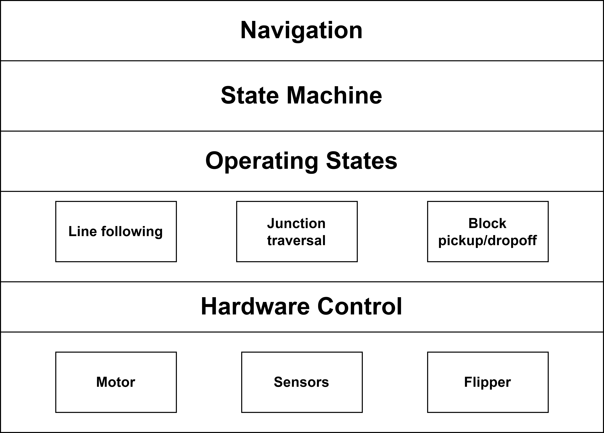

# IDP software



## Navigation
- All contained in **`navigation.cpp`**
- Had hard-coded arrays of states to move the robot between set parts of the course (e.g. start to first residential block)
- Switched array when a block was identified depending on whether it needed to be dropped off in the red or green zone
- Had Boolean variables which tracked which blocks had been picked up
- Also, had the option to follow a custom array of states which could be defined in a separate file for specific test cases

## State Machine
- All contained in **`state_machine.cpp`**
- Used a state machine which ran a particular function depending on the current state
- Used an enumeration for the result of each state function to determine whether to change state
```cpp
typedef enum {
    STATE_REPEAT,
    STATE_EXIT,
    STATE_ERROR,
    STATE_DETECTION_SOLID,
    STATE_DETECTION_FOAM,
} STATE_result_e;
```
- If changing state, would call `NAV_next` function from navigation.cpp to get the next state for that route

## Operating States
### Line following
- Defined in **`line_movement.cpp`**
- Used four line sensors with two on the line, and two on the far left and right to detect junctions
- Exited line following state when junction was detected, although used a timeout to prevent state exit if it had only recently started line following to prevent detecting a new junction as it left a previous junction
- Also had states to line follow backwards, for a set time, and while the time-of-flight measurement was above a threshold
### Junction traversal
- Defined in **`junction.cpp`**
- Would nudge forward at junctions, then rotate on the spot until the central two line sensors where triggered
- Had states to do left/right turns, going forwards and backwards
- Also had states to turn 90&deg; and 180&deg; on a line rather than at a junction
- Also had a `NAV_JUNC_CONFIRM` state which was used for problematic turns to correct after the turn
### Block pickup/dropoff
- Defined in **`flipper_and_detection.cpp`**
- Continuously read the limit switch output during block pickup, and would identify the block as solid if the limit switch was triggered at any point during pickup

## Hardware Control
- Had separate files for controlling different parts of the hardware.
- **`motor.cpp`** – included function to set motor speeds, only updating the motors if values were different to those last set, and to add a multiplier to the motor power to correct for uneven motor speeds
- **`sensors.cpp`** – included function to read time-of-flight sensor and line sensors. Also included unused code to average line sensor data over a period using a circular buffer
- **`flipper_and_detection.cpp`** – functions to move the servo motor for the flipper to a specific angle

